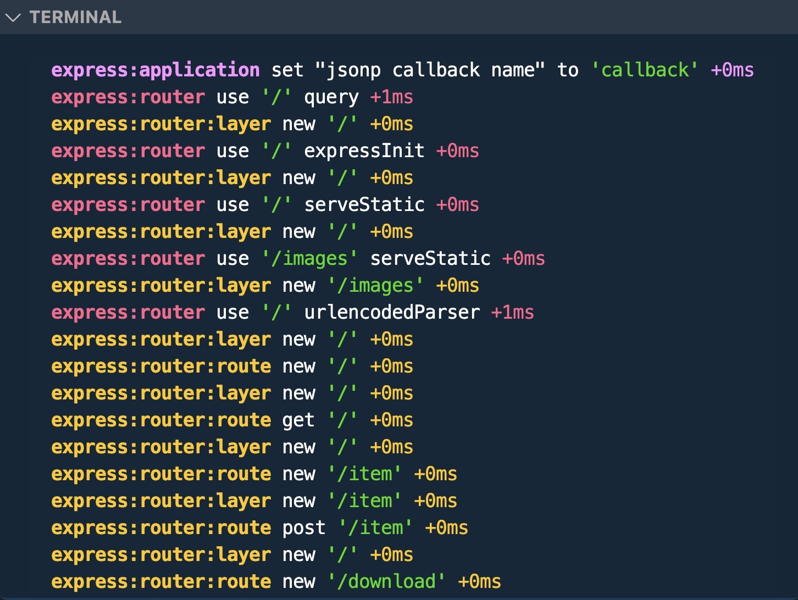

# Name of project

Express essentials

## Table of contents

- [Name of project](#name-of-project)
  - [Table of contents](#table-of-contents)
  - [General info](#general-info)
  - [Screenshots](#screenshots)
  - [Technologies](#technologies)
  - [Setup](#setup)
  - [Code Examples](#code-examples)
  - [Features](#features)
  - [Status](#status)
  - [Inspiration](#inspiration)
  - [Contact](#contact)

## General info

- Express is a node framework
- Express can use template languages to create HTML, like Jade, Pug, Mustache, EJS, Dust, HBS, HJS, Twig, Vash
- Express Application Generator is a package used to create the boilercode for an Express application. [link](https://expressjs.com/en/starter/generator.html)

This project was built following [this tutorial](https://www.linkedin.com/learning/express-essential-training-14539342)

## Screenshots



## Technologies

- Node 18.16.1
- Express 4.16.1

## Setup

### Run testapp

change directory:  
`$ cd testapp`

install dependencies:  
`$ npm install`

run the app:  
`$ DEBUG=testapp:* npm start`

### Run express essentials

change directory:  
`$ cd express_essentials`

install dependencies:  
`$ npm install`

run the app:  
`$ npm start`
`$ npm debug`

#### routes availables (express essentials)

- localhost:3000
- localhost:3000/public/mountain_1.jpg
- localhost:3000/images/mountain_2.jpg
- localhost:3000/download
- localhost:3000/redirect
- localhost:3000/item (POST, send header and body in Postman { "item": "rollerblades"})
- localhost:3000/class (GET, POST, PUT)
- localhost:3000/next
- localhost:3000/class/:id

## Code Examples

```js
// Chaining
app
  .route("/class")
  .get((request, response) => {
    // response.send("Retrieve class info");
    throw new Error();
  })
  .post((request, response) => {
    response.send("Create class info");
  })
  .put((request, response) => {
    response.send("Update class info");
  });
```

## Features

List of features:

- simple backend
- several routes to test the app

## Status

Project is: _done_

## Inspiration

Project by Linkedin

## Contact

By bermarte
